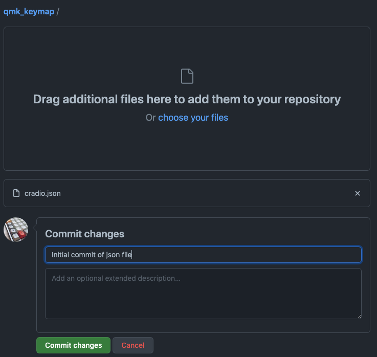
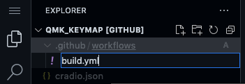

# Building QMK with GitHub Action Workflow

QMK firmware can be compiled entirely on GitHub using Action workflow, without any tools installed locally. To begin, you will need a GitHub account setup.

# Create A Keymap

Start by visiting the [QMK Configurator](https://config.qmk.fm/#/) site. Select your keyboard from the drop-down list, and layout. Use your GitHub account username for the `Keymap Name` field, e.g.


Customise the keymap according to your preference. Click on the download icon next to `KEYMAP.JSON` to save the layout file into your computer. Rename it to your keyboard name, e.g. `cradio.json`, and note its location.

# Create A Repository

Login to your GitHub account, select the `Repositories` tab, and click on `New` on the right to create a new repository. You can name it `qmk_keymap` (or a unique name). Leave the other settings as default and click on `Create repository` at the bottom of the page:


In the `Quick setup` page that follows, select `uploading an existing file`. Find the json file from the previous step (`cradio.json` in the example), and drag that file into the browser page to upload it. In the `Commit Changes`, write a meaningful commit message and select `Commit changes` at the bottom of the page:



# Create A Workflow File

Back in the `/ qmk_keymap` repository page, press the period (`.`) key. The [github.dev](https://docs.github.com/en/codespaces/the-githubdev-web-based-editor) web-based VS Code editor will be loaded. This interface is where you can edit and commit code directly to GitHub.

Click on the `Explorer` column on the left, and click on the `New Folder` icon and create a folder named `.github/workflows` (note the `.` prefix); press enter to create that folder:


Click on the newly created `.github/workflows` folder and select the `New File` icon and create a file named `build.yml`; press enter to create that file:



With the `build.yml` file selected, paste the following workflow content into the editor window on the right side:

```yml

name: Build QMK firmware
on: [push, workflow_dispatch]

jobs:
  build:
    runs-on: ubuntu-latest
    container: qmkfm/base_container
    strategy:
      fail-fast: false
      matrix:
# Start of build matrix
# List the keyboard file names here
        keyboard:
        - cradio.json
# List the username here
        keymap:
        - ${{ github.actor }}
# End of build matrix

    steps:

    - name: Checkout QMK
      uses: actions/checkout@v2
      with:
        repository: qmk/qmk_firmware
        ref: develop
        fetch-depth: 1
        persist-credentials: false
        submodules: recursive

    - name: Checkout userspace
      uses: actions/checkout@v2
      with:
        path: users/${{ matrix.keymap }}
        fetch-depth: 1
        persist-credentials: false

    - name: Build firmware
      run: qmk compile "users/${{ matrix.keymap }}/${{ matrix.keyboard }}"

    - name: Archive firmware
      uses: actions/upload-artifact@v2
      with:
        name: ${{ matrix.keyboard }}_${{ matrix.keymap }}
        retention-days: 2
        path: |
          *.hex
          *.bin
          *.uf2
      continue-on-error: true

```

Do note that proper spacing is important for the workflow file. The file is saved automatically.

## Customising the Workflow

Change the file name under `keyboard:` to the name of your json file. You can add additional entries here to build more than one keyboard. Each file name must be prefixed with a dash `-` character.

## Committing the Workflow

Click on `Source Control` in the left column, enter a meaningful commit message, and click on the `Commit` checkmark above to commit the file directly to your repository:


# Review Workflow actions

Return to your [GitHub](https://github.com/) page, find the `qmk_keymap` repository, and select the `Actions` tab. Here you will find the `Build QMK Firmware` workflow. Selecting the workflow will display its run from the last commit. Selecting that will show its run status. If the committed files were compiled successfully, you will find the compiled firmware ready for download under the `Artifacts` section:


You can proceed to customise QMK using the [Userspace guide](https://docs.qmk.fm/#/feature_userspace) with the [github.dev](https://docs.github.com/en/codespaces/the-githubdev-web-based-editor) web-based editor. Keymaps for any additional keyboards must be retained in json format, and appended to the `keyboard:` matrix list of `build.yml`. Custom source codes can be added into C files (e.g. `source.c`) that are appended into `rules.mk` (e.g. `SRC += source.c`).
