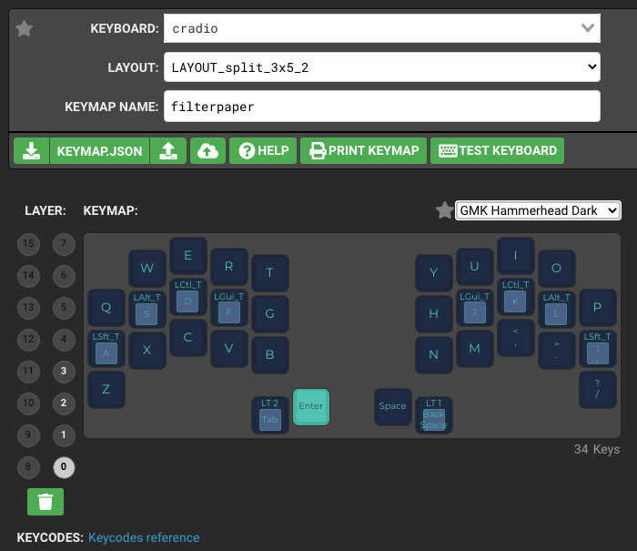
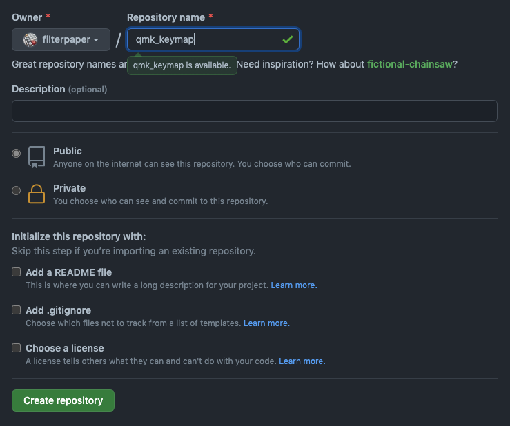
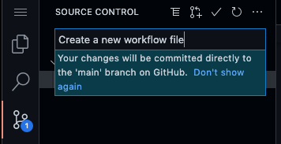
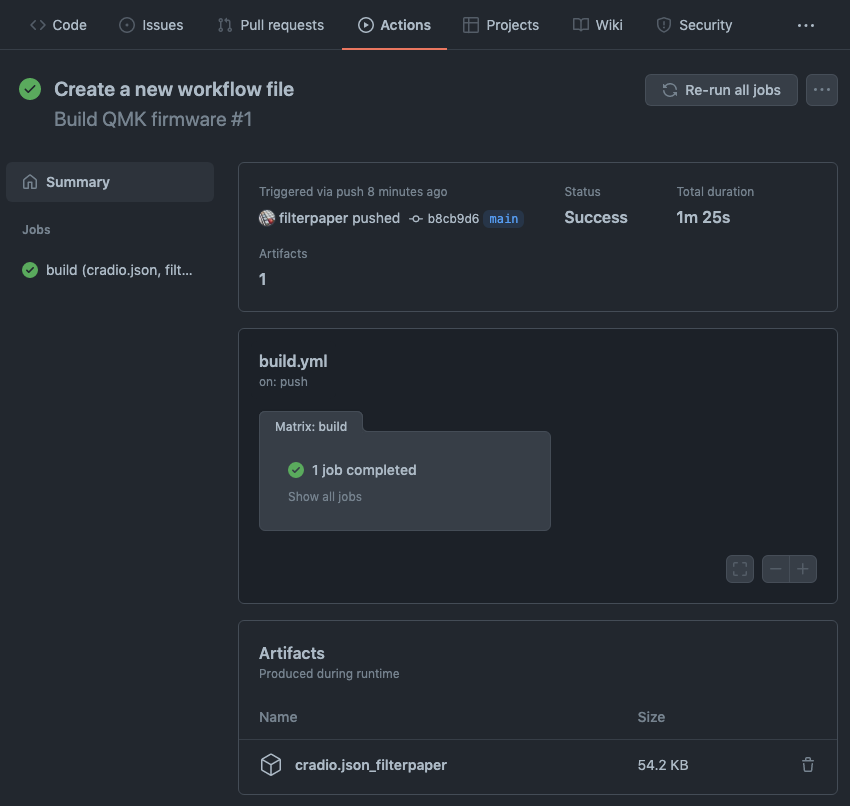

# QMK with GitHub Workflow

Building QMK firmware locally with a `git` clone of a fork and `gcc` tools can consume a lot of disk space. This is an alternative build environment that can be setup to run entirely on GitHub using Action workflow. It uses a standalone [Userspace](userspace.md) repository and a workflow that will build QMK firmware in a container. To begin, you will need an account on [GitHub](https://github.com/).

# Create a Keymap

* Start by visiting the [QMK Configurator](https://config.qmk.fm/#/) site.
* Select your keyboard from the drop-down list (and choose a layout if required).
* Use your GitHub username for the `Keymap Name` field, e.g.:



* Customise the key map according to your preference.
* When you're done, click on the download icon next to `KEYMAP.JSON` to save the layout file into your computer.
* Rename the json to your keyboard name, e.g. `cradio.json`, and note its location.

# Create a Repository

* Login to your GitHub account.
* Select the `Repositories` tab, and click on `New` on the right to create a new repository.
* You can name it `qmk_keymap` (or anything unique).
* Leave the other settings as default and click on `Create repository` at the bottom of the page:



* In the `Quick setup` page that follows, select `uploading an existing file`.
* Find the json file from the previous step (`cradio.json` in the example) and drag it into the browser page to upload.
* Write a meaningful commit message below and select `Commit changes` at the bottom of the page:


# Create a Workflow file

Back in the `qmk_keymap` repository page, press the period (`.`) key. The [github.dev](https://docs.github.com/en/codespaces/the-githubdev-web-based-editor) web-based VSCode editor will be loaded. This interface is where you can edit and commit code directly to GitHub.

* In the left `Explorer` section, click on the `New Folder` icon to create a folder named `.github/workflows` (note the `.` prefix). Press enter to complete the action:


* Click on the new `.github/workflows` folder and select the `New File` icon. Create a file named `build.yml` and press enter to complete:


* With the `build.yml` file selected, paste the following workflow content into the editor window on the right side:

```yml


name: Build QMK firmware
on: [push, workflow_dispatch]

jobs:
  build:
    runs-on: ubuntu-latest
    container: qmkfm/base_container
    strategy:
      fail-fast: false
      matrix:
# Start of build matrix
# List the keyboard file names here
        file:
        - cradio.json
# List the username here
        user:
        - ${{ github.actor }}
# End of build matrix

    steps:

    - name: Checkout QMK
      uses: actions/checkout@v2
      with:
        repository: qmk/qmk_firmware
        ref: develop
        fetch-depth: 1
        persist-credentials: false
        submodules: recursive

    - name: Checkout userspace
      uses: actions/checkout@v2
      with:
        path: users/${{ matrix.user }}
        fetch-depth: 1
        persist-credentials: false

    - name: Build firmware
      run: qmk compile "users/${{ matrix.user }}/${{ matrix.file }}"

    - name: Archive firmware
      uses: actions/upload-artifact@v2
      with:
        name: ${{ matrix.file }}_${{ matrix.user }}
        retention-days: 5
        path: |
          *.hex
          *.bin
          *.uf2
      continue-on-error: true

```

Do note that proper spacing is important in the workflow `yml` file.

## Customising the Workflow

The matrix `file:` is a list of json files to be built (`- cradio.json` in the example).
̃* Change this section to the name of your json file. Additional entries (with `-` prefix) can be added here to build more than one keyboard.
̃* The `user:` section defaults to your GitHub username. Change that line accordingly if you used a different keymap name for the json file in the first step.

## Committing the Workflow

* Click on `Source Control` in the left column, enter a meaningful commit message.
* Click on the `Commit` checkmark above to commit the file directly to your repository:



# Review Workflow actions

Return to your [GitHub](https://github.com/) page, find the `qmk_keymap` repository, and select the `Actions` tab. Here you will find the `Build QMK Firmware` workflow. Selecting the workflow will display its run from the last commit. Selecting that will show its run status. If the committed files were compiled successfully, you will find the compiled firmware ready for download under the `Artifacts` section:



They can be downloaded and flashed into your keyboard using [QMK Toolbox](https://docs.qmk.fm/#/newbs_flashing?id=flashing-your-keyboard-with-qmk-toolbox).

# Next Steps

You can proceed to customise QMK using the [Userspace guide](https://docs.qmk.fm/#/feature_userspace) with the [github.dev](https://docs.github.com/en/codespaces/the-githubdev-web-based-editor) web-based editor. Keymaps for any additional keyboards must be retained in json format, and appended to the `keyboard:` matrix list of `build.yml`. Custom source codes can be added into C files (e.g. `source.c`) that are appended into `rules.mk` (e.g. `SRC += source.c`).
